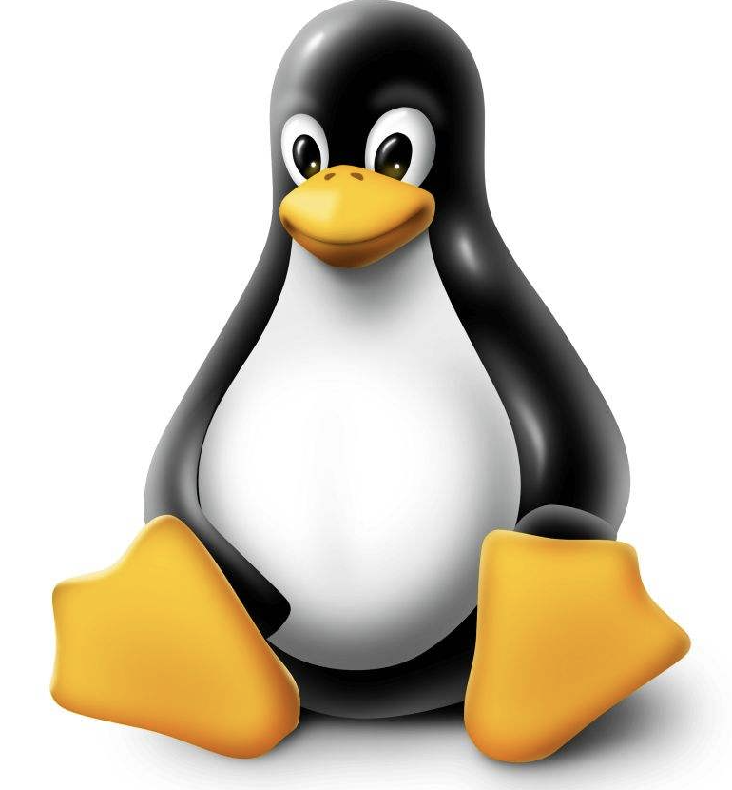
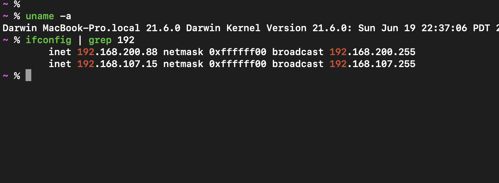
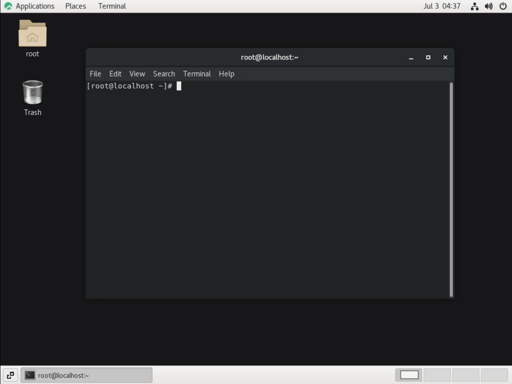
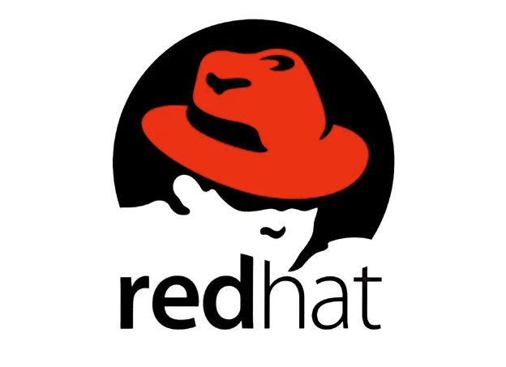
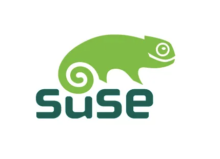
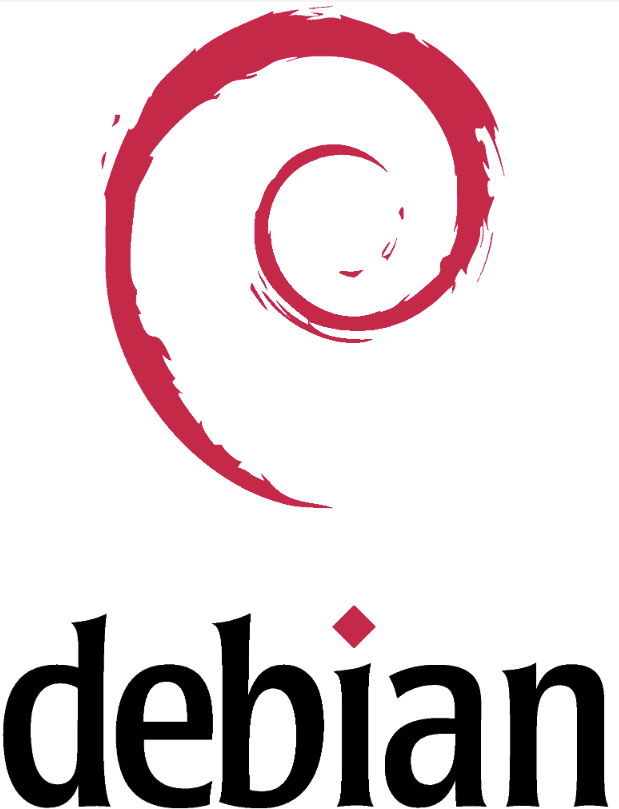
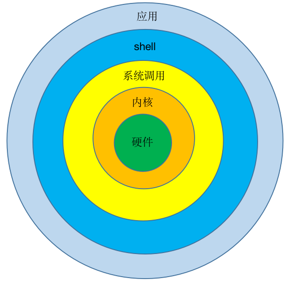

## 1.1 认识Linux

- 本节首先介绍
  - Linux系统的历史，然后介绍Linux的系统的特、什么是Linux系统的开发版以及Linux系统的结构。

### 1.1.1 Linux系统的历史

- Linux系统是一个类似UNIX的操作系统。UNIX操作系统是1969年由K.Thompson和D.M.Richie在美国贝尔实验室开发的一种操作系统。Linux系统是UNIX在微机上的完整实现，它的标志是一个名为Tux的可爱的小企鹅，如图1.1.1所示。
- 

 图1.1.1 

- 1990年，芬兰人LinusTorvalds开始着手研究编写一个开放的与Minix系统兼容的操作系统。1991年10月5日，LinusTorvalds公布了第一个Linux的内核版本0.02版。1992年3月，内核1.0版本的推出，标志着Linux第一个正式版本的诞生。LinusTorvalds 也是Linux最早一版的作者和一直到今天的最新版内核主要维护者之一。

- Linux操作系统具有安全、稳定、开源等优势。主要涉及，桌面应用、嵌入式应用和服务器应用，尤其是服务器应用领域Linux系统占比很高。

### 1.1.2 Linux系统的特点

#### Linux版权说明 

- Linux是基于Copyleft（无版权）的软件模式进行发布的。它是GNU项目制定的通用公共许可证（GeneralPublic License，GPL）。GNU项目的标志是角马,如图1.1.2所示。

 图1.1.2 

- GPL是由自由软件基金会发行的用于计算机软件的协议证书，使用证书的软件被称为自由软件（后来改名为开放源代码软件（OpenSource Software）。Linux操作系统是一个免费、自由、开放的操作系统,完全免费。任何人都有使用、复制和修改Linux 系统，不必担心成为"盗版"用户。Linux 继承了 UNIX核心的设计思想，具有执行效率高、安全性高和稳定性好的特点、支持多种硬件平台、友好的用户界面、强大的网络功能支持多任务、多用户。

#### Linux系统参数介绍

- 支持几十种文件系统：FT16, FAT32, NTFS, Ext2, Ext3, HPFS, UFS, ISO
- 内存管理模式：空闲内存可作为缓冲区（Buffer），加快程序运行

- 强大的网络功能：Linux内置了很丰富的免费网络服务器软件、数据库和网页的开发工具，如Apache、Sendmail、VSFtp、Squid等。近年来，越来越多的企业看到了Linux 的这些强大的功能，利用Linux担任全方位的网络服务器。

- 良好的用户界面:
  - Linux向用户提供了两种界面：
    - Shell

      - Linux的传统用户界面是基于文本的命令行界面，即Shell，如图1.1.3所示。实际上Shell是一个命令解释器，它解释由用户输入的命令并且把它们送到内核。不仅如此，Shell有自己的编程语言用于对命令的编辑，它允许用户编写由Shell命令组成的程序。Shell编程语言具有普通编程语言的很多特点，比如它也有循环结构和分支控制结构等，用这种编程语言编写的Shell程序与其他应用程序具有同样的效果。

       
      
      
       图1.1.3 

    - 图形用户界面
      - Linux也提供了图形化界面,如图1.1.4所示。它利用鼠标、菜单、窗口、滚动条等设施，给用户呈现一个直观、易操作、交互性强的友好的图形化界面。

       
      
      
      
       
      
       图1.1.4 

- 可靠的系统安全：Linux采用了许多安全技术措施，包括对读、写控制、带保护的子系统、审计跟踪、核心授权等，这为网络多用户环境中的用户提供了强有力的安全保障。

- 良好的可移植性：Linux可移植性是指将操作系统从一个平台转移到另一个平台使它仍能按照自身方式运行的能力。Linux是一种可移植的操作系统，能够在微型计算机到大型计算机的任何环境下运行。

### 1.1.3 Linux发展趋势

#### Linux发行版介绍 

- Linux发行版是一种可安装的操作系统，由Linux内核以及提供支持的用户程序和库构建而成。完整的Linux操作系统不是由单个组织开发的，而是由一系列处理各个软件组件的独立开源开发社区开发的。发行版让用户能够轻松安装和管理正常运行的Linux系统。内核是操作系统的核心组件，它管理硬件、内存以及运行中程序的调度。这种Linux 内核又可通过其他开源软件加以补充，如来自 GNU项目的实用工具和程序.来自 MT 的X Window System 的图形界面，以及 Sendmail邮件服务器或 Apache HTTP Web 服务器等诸多其他开源组件，以构建一个完整、开源的类 Unix操作系统。然而，Linux用户面临的挑战之一是从许多不同的来源组装所有这些部分。在其发展历程的极早阶段，Linux开发人员开始致力于提供经过预构建和测试的工具的发行版，以供用户下载并用来快速设置Linux系统。有许多不同的Linux发行版，其目标各不相同，用于选择和支持其发行版提供的软件的标准也不同。但是，发行版通常具有很多共同的特征：
  - 发行版由 Linux 内核和提供支持的用户空间程序组成。
  - 发行版可以较小并目用途单一也可包含数以千计的开源程序。
  - 发行版必须提供安装和更新发行版及其组件的途径。
  - Linux内核 ＋ 各种自由软件 ＝ 完整的操作系统
  - Linux发行版的名称、版本由发行厂商决定,下面介绍一些常见的Linux开发版:

    - Red Hat Enterprise Linux：由Red Hat公司发布，如图1.1.5所示。RedHatLinux是RedHat 最早发行的个人版本的 Linux，其 1.0版本于1994年1月3日发行。目前 RedHat 分为两个系列：由 RedHat公司提供收费技术支持和更新的 RedHat Enterprise Linux，以及社区开发的免费的 Fedora Core。

     
    
    
    
     
    
     图1.1.5 

    - Suse Linux：由Novell公司发布，如图1.1.6所示。企业级应用首选suse linux。企业级的应用追求的是可靠性和稳定性，这就要求构建企业级应用的系统平台具有高可靠性和高稳定性。企业级Linux的发行版本就是解决的这个问题。SUSE 是德国著名的 Linux 发行版，在全世界范围中也享有很高的声誉。

     
    
    
    
     
    
     图1.1.6 

    - Debian Linux：由Debian社区发布，如图1.1.7所示。Debian 项目是一个由个人组成的组织，所有人拥有一个共同目标：创建一个自由的操作系统，让所有人都能够自由获取。Debian是一款完全自由的操作系统，目前，Debian系统采用 Linux 内核或者 FreeBSD 内核。Debian可以帮助我们完成：从文档编辑，到电子商务，到游戏娱乐，到软件开发。
     
    
    
    
     
    
     图1.1.7 

#### 行业应用逐渐扩展，差异化解决方案需求增长

- 经过几年的技术磨砺与市场培育，Linux 行业应用市场逐步细化，在金融、电信、邮政、传媒、烟草等行业的应用也不断增多。成功应用案例不断增加，企业级用户在Linux平台上部署解决方案时，对系统稳定性、可靠性、高性能和安全性等问题也逐步打消疑虑，树立了信心。因此，在商用市场中，市场需要成熟的基于Linux的、针对行业的应用解决方案，解决方案提供商在Linux应用开发过程中能够从厂商获得足够的技术支持，并提供满足用户需求基础之上的安全性、高效性、可移植性最好，以及成本最低的解决方案是趋势所在。

#### 服务在Linux收入结构中的比重逐渐增大

- 随着Linux 应用的逐渐深入，Linux本土厂商和应用企业正逐步接受以服务来获取收入的销售方式，而国外厂商Novell和红帽的进入，更将它们在国外采用的成熟的销售方式带入了中国，加速了中国客户对这一销售方式的认可。中国的Linux厂商也逐渐对以服务获取收入的销售方式达成了共识，并正在努力调整自己的销售策略和开发策略，越来越多的收入来自Linux的技术服务，而不是Linux产品的销售。

### 1.1.4 Linux系统组成

#### Linux系统基本构成

- Linux 系统一般有4个主要部分：内核、shell、系统调用和应用程序。内核、shell 和系统调用一起形成了基本的操作系统结构，它们使得用户可以运行程序、管理文件并使用系统。部分层次结构，如图1.1.8所示。
 

 

 图1.1.8 

#### Linux系统内核 

- 内核是操作系统的核心，具有很多最基本功能，如虚拟内存、多任务、共享库、需求加载、可执行程序和TCP/IP网络功能。Linux内核的模块分为以下几个部分：存储管理、CPU和进程管理、文件系统、设备管理和驱动、网络通信、系统的初始化和系统调用等。

#### Linux中的shell

- shell是系统的用户界面，提供了用户与内核进行交互操作的一种接口。它接收用户输入的命令并把它送入内核去执行，是一个命令解释器。另外，shell编程语言具有普通编程语言的很多特点，用这种编程语言编写的shell程序与其他应用程序具有同样的效果。

#### Linux的应用程序

- 标准的Linux系统一般都有一套都有称为应用程序的程序集，它包括文本编辑器、编程语言、X Window、办公套件、Internet工具和数据库等。

