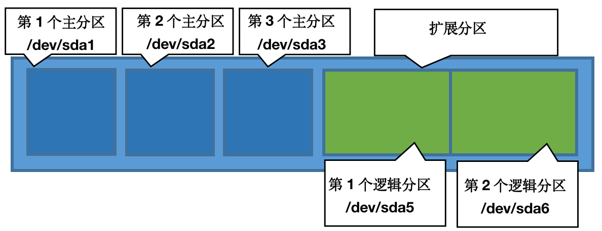
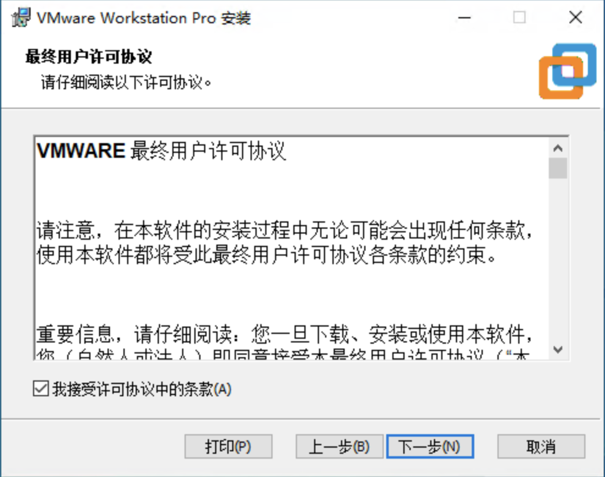
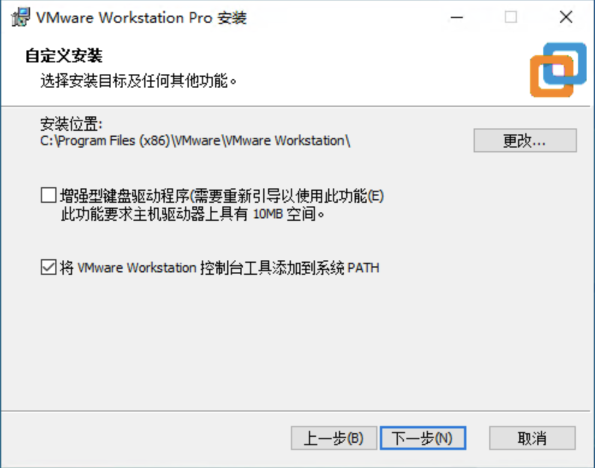
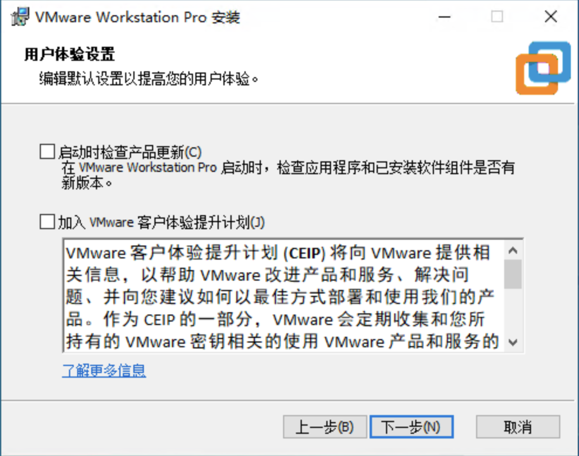
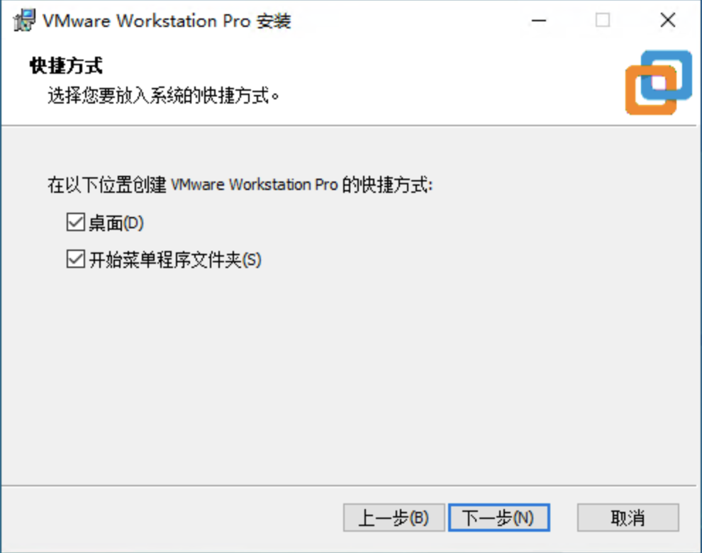
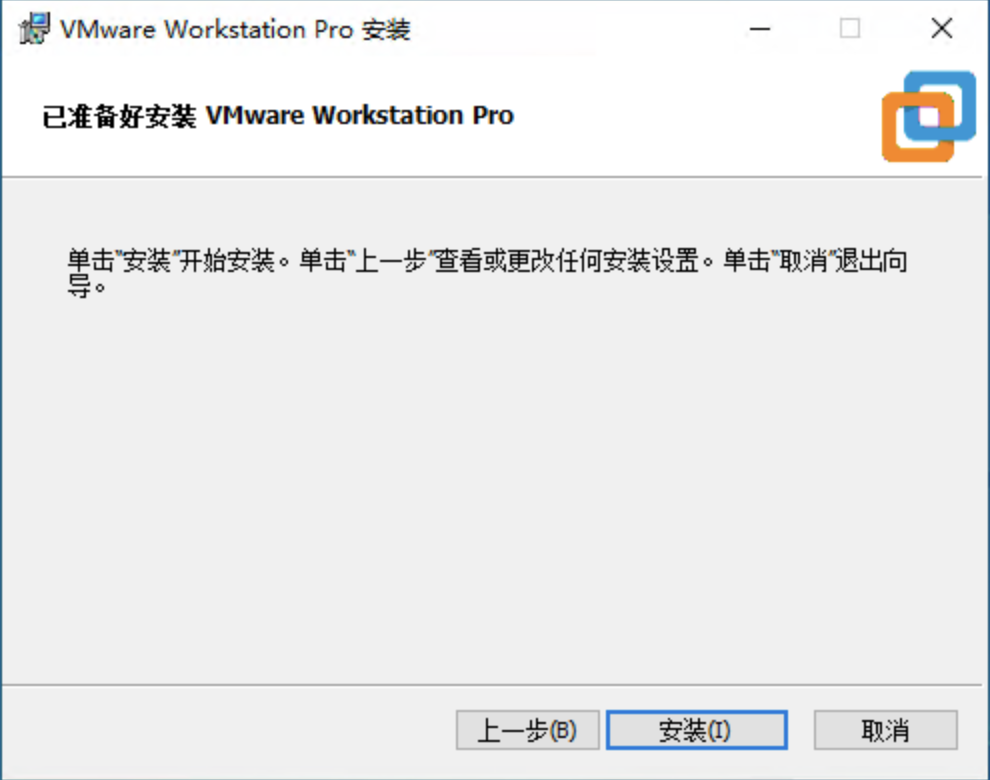
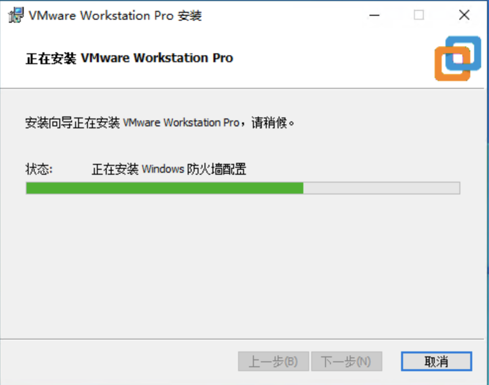
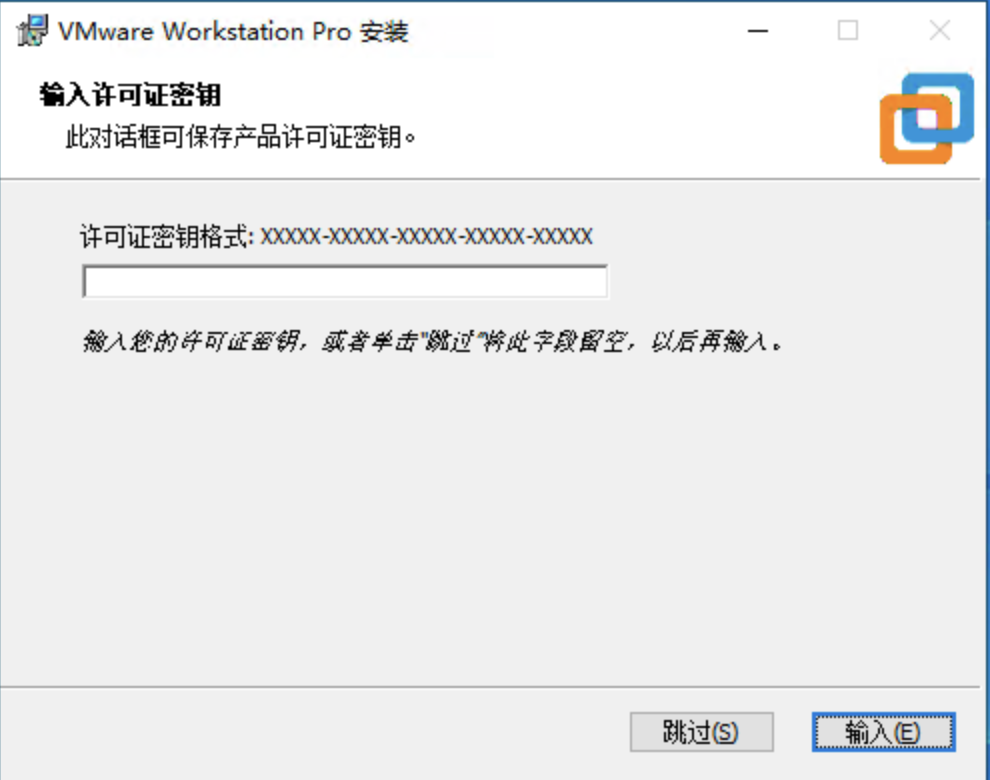
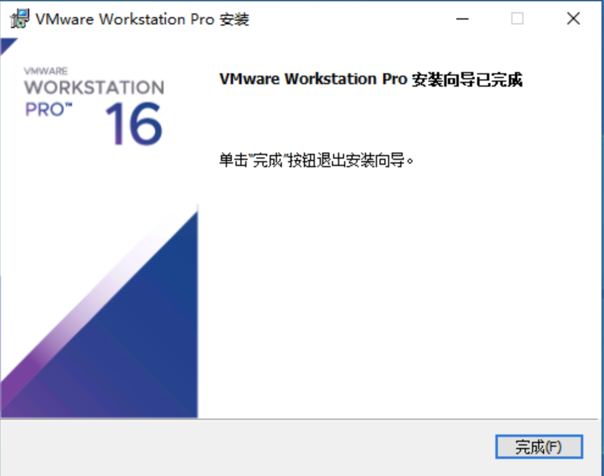

## 1.2 VMware虚拟机软件的安装

- 虚拟机（Virtual Machine）通过软件模拟真实计算机的硬件系统和软件系统。真实的计算机被称作"物理机"，而通过虚拟机软件虚拟出来的计算机称为"虚拟机"。常见的虚拟机软件有VMware和VirturalBox。虚拟机软件可以在物理机上安装若干个虚拟计算机，每台计算机都有自己独立的硬件和软件资源。虛拟机可以安装Windows系统，也可以安装 Linux 的各个发行版，各个系统之间可以相互运行而互不干扰，即使单个系统崩溃也不会影响其他的系统。

### 1.2.1 安装前准备

#### 安装方式

- Linux系统提供了多种安装方式支持：
  - CD-ROM/DVD启动安装
  - 从硬盘安装
  - 从NFS服务器安装
  - 从FTP/HTTP服务器安装
  - 从U盘启动安装

#### 硬件设备命名规则
- Linux系统中的一切都是文件，硬件设备也是用文件的方式显示的，文件和硬件名称关联如表1.2.1所示。

 表1.2.1 

 

| 硬件设备 | 文件名称 |
| -------- | -------- |
| IDE设备 | /dev/hd[a-d] |
| SCSI/SATA/U盘 | /dev/sd[a-p] |
| 软驱 | /dev/fd[0-1] |
| 打印机 | /dev/lp[0-15] |
| 光驱 | /dev/cdrom |
| 鼠标 | /dev/mouse |
| 磁带机 | /dev/st0或/dev/ht0 |

 

#### 硬盘分区结构 

- Linux中用a-p来代表16块不同的硬盘，默认是从a开始，主分区或者扩展分区的编号从1开始到4结束，逻辑分区从5开始编号，如图1.2.2所示，展示了一个基本分区布局。
 

 

 图1.2.2 

- /dev/目录中保存的硬件设备文件sd表示是存储设备，a表示系统中同类接口中第一个被识别到的设备5表示这个设备是一个逻辑分区。"/dev/sda5"表示的就是"这是系统中第一块被识别到的硬件设备中分区编号为5的逻辑分区的设备文件"，如图1.2.3所示。

 

 

 图1.2.3 

#### Linux简单分区规划 {#linux简单分区规划 .unnumbered}
- Linux系统至少要有两个分区：
  - 根分区（/）：一切从根开始，根据Linux系统安装后占用资源的大小和所需要保存数据的多少来调整大小（一般情况下，划分15GB-20GB就足够了）
  - 交换分区（swap）：用于实现虚拟内存，物理内存1-2倍

- 其他可创建分区：
  - /boot分区：用于保存系统启动时所需要的文件，200-300M左右
  - /usr分区：操作系统基本都在这个分区中
  - /home分区：所有的用户信息都在这个分区下
  - /var分区：服务器的登录文件、邮件、Web服务器的数据文件都会放在这个分区中

### 1.2.2 安装VMware虚拟机软件

- 本次安装的VMware虚拟机软件版本为VMware Workstation 16。双击安装程序，打开安装向导，单击"下一步"按钮，如图1.2.5所示。

 

 

 图1.2.5 

- 选择"我接受许可协议条款"，然后单击"下一步"按钮，如图1.2.6所示。

 

 

 图1.2.6 

- 选择软件安装路径，默认安装在C驱动器中，这里使用默认位置安装，直接单击"下一步"按钮，如图1.2.7所示。

 

 

 图1.2.7 

- 取消"检查时启动"和"加入VMware"，然后单击"下一步"按钮，如图1.2.8所示。

 

 

 图1.2.8 

- 单击"下一步"按钮，如图1.2.9所示。

 

 

 图1.2.9 

- 单击"安装"按钮，如图1.2.10所示。

 

 

 图1.2.10 

- 进入自动安装界面，如图1.2.11所示。

 

 

 图1.2.11 

- 安装完成后，单击"许可证"按钮，输入相应许可证后单击"输入"按钮,如图1.2.12所示。

 

 

 图1.2.12 

- 单击"完成"按钮即可完成安装，如图1.2.13所示。

 

 

 图1.2.13 
