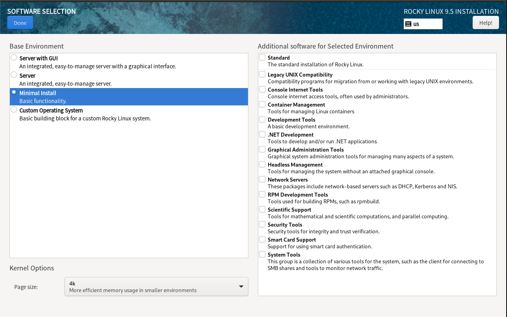
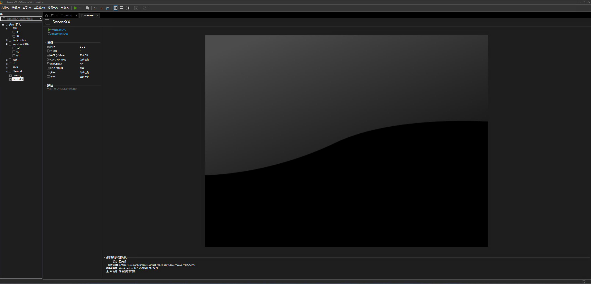
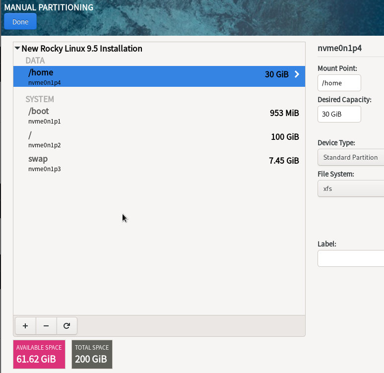
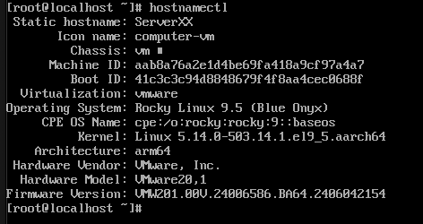

## 实验任务： Linux系统安装与基本配置
- 项目名称: Linux系统安装与基本配置
- 实训对象:
- 课程名称: Linux网络操作系统
- 教材:
- 项目背景：
    - 由于公司部分windows服务器频繁遭受病毒、木马的威胁，同时鉴于Linux系统在服务器领域的稳定性，公司决定安装Rocky9操作系统，并在该系统之上构建各种服务器。
- 实训目的：
    - 熟练掌握VMware 的使用方法。
    - 掌握安装Linux网络操作系统的方法。
    - 学会Linux网络操作系统的基本网络配置。
- 学时：
#### 实验要求
- 在VMware中安装Rocky9 linux操作系统，虚拟机名称为Serverxx,安装位置默认，内存为2G，CPU数量为2，核心数为1，硬盘大小为200GB，设置主机名为Serverxx(xx为学号)：
- 分区规划如下：
    - /boot: 1 GB
    - /boot efi：1GB（UEFI 启动方式）
    - swap: 8 GB
    - /: 100 GB
    - /home: 30 GB
    - 剩余空间预留不分配
    
- 安装时要求将该主机配置为最小安装

- 将创建好的虚拟机截图

- 按照要求完成分区

- 安装完成后在终端使用hostnamectl指令查看当前主机名

#### 其他问题
- 请简要介绍Rocky Linux Server操作系统，并说明它的主要用途和特点。
  - 答:
      - Rocky Linux是一个自由和开放源代码的企业级Linux操作系统，由Greg Kurtzer创建，旨在成为一个可替代CentOS的Linux发行版。它是基于Red Hat Enterprise Linux (RHEL)源代码构建的，具有稳定性、安全性和可靠性的特点。Rocky Linux的主要用途是作为企业级应用程序、数据库服务器和Web服务器的操作系统。

- 请列出安装Rocky Linux Server所需的最低系统要求，并解释这些要求的含义。
  - 答:
    - 安装Rocky Linux Server所需的最低系统要求如下：
       - 2GHz双核处理器或更高
       - 4GB RAM或更高
       - 20GB硬盘空间或更高

- 请解释分区规划的重要性，并列出该练习题中各个分区的作用和大小。
  - 答:
    - /boot 分区：存储操作系统内核和启动相关的文件，通常大小为 500 MB。
    - swap 分区：提供操作系统使用的虚拟内存空间，通常大小为物理内存大小的两倍。
    - / 分区：包含操作系统和程序文件，通常大小为 20 GB。
    - /usr 分区：存储用户安装的软件程序和文件，通常大小为 30 GB。
    - /home 分区：存储用户的个人数据和配置文件，通常大小为 50 GB 或更多，具体取决于用户需求。
    - /var 分区：存储系统日志、邮件和数据库文件等变化频繁的数据，通常大小为 15 GB。
    - /tmp 分区：存储临时文件和缓存文件，通常大小为 10 GB。
    - /opt 分区：存储第三方软件包，通常大小为 20 GB。
    - /usr/local 分区：存储本地安装的软件程序和文件，通常大小为 20 GB。
    - /srv 分区：存储网络服务提供的数据，通常大小为 10 GB。
    - /backup 分区：存储备份文件和数据，通常大小为 100 GB 或更多，具体取决于备份策略和需求。
    - 预留空间：预留一定的空间，以备不时之需。
    - 这个分区方案可以提供良好的性能和可靠性，可以满足大多数用户的需求。但是，对于不同的应用和场景，分区方案可能会有所不同。因此，在分区规划时，需要考虑到具体的需求和使用情况，并进行相应的调整。

## 二、任务提交

- 将每个任务按照题号和步骤将所有截图放入实训报告，并命名为学号全称+姓名进行提交。