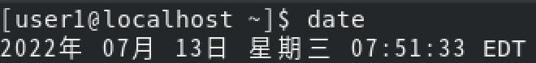

## 2.2 Linux系统终端

虽然Linux系统也提供了类似于Windows系统的图形界面，但是一般系统管理员在使用的时候还是倾向于使用命令行。使用命令可以方便快速地完成任何针对系统的操作。

### 2.2.1命令行概述

#### 1.shell

- 命令行，指的就是shell。
- shell是一个程序，它接受从键盘输入的命令，然后把命令传递给操作系统执行。几乎所有的Linux发行版都提供一个名为bash的shell程序。

#### 2.终端程序

- 当使用图形界面的Linux操作系统时，需要一个和shell交互的工具，叫做终端程序。在Linux系统中这个程序被命名为"terminal"。其中GNOME桌面使用的终端程序名为
  "gnome-terminal"。还有其他一些终端程序可供Linux使用。基本所有不同版本的终端程序目的都是为了能访问shell。

#### 3.终端程序的基本操作

- 打开终端程序

  - 以Centos8的gnome-terminal桌面环境为例，打开终端程序的步骤如下:

    - 登陆系统后，单击桌面左上角的"活动"按钮,如图2.2.1所示。

      
    
    
    
     

     图2.2.1 

    - 在左边的菜单中单击"终端"按钮，打开终端，如图2.2.2所示。

    
    图2.2.2 

    - 终端界面如图2.2.3所示。

    
    
     图2.2.3 

- 在终端中输入命令
- 当终端程序运行之后，会显示一串字符，这些字符叫做shell提示符，如图2.2.4所示。


 图2.2.4 

- shell提示符会以各种样式显示，这则取决于不同的Linux发行版，通常包括"用户名@主机名"，紧接着当前工作目录和一个"\$"。

  - 如果提示符的最后一个字符是"#", 那么这个终端会话就拥有超级用户权限。
  - 如果提示符的最后一个字符是"\$"则表示，这是一个普通用户。
  - 如果向终端中输入如下字符"kaekfjaeifj"。由于输入的字符没有任何意义，所以shell会提示错误信息,如图2.2.5所示。

![[2.2.5.png]]
   
图2.2.5 

- 下面执行一些简单的shell命令：
  - date命令，该命令显示系统当前时间和日期，如图2.2.6所示。



   图2.2.6 

  - cal命令，该命令默认显示当前月份的日历，如图2.2.7所示。


  
   图2.2.7 

## 2.3 文件管理命令

- 文件是Linux操作系统的基本组成单元。文件管理包括复制、移动、修改等。本节主要介绍Linux文件管理相关命令。

#### 2.3.1 复制命令cp

##### 命令简介
- cp命令用来将一个或多个源文件或者目录复制到指定的目的文件或目录。它可以将单个源文件复制成一个指定文件名的具体的文件或一个已经存在的目录下。
- cp命令还支持同时复制多个文件，当一次复制多个文件时，目标文件参数必须是一个已经存在的目录，否则将出现错误。

##### 命令语法 {#命令语法 .unnumbered}
```shell
cp [option] source dest

cp [option] source directory

#option：cp命令的选项
#source：源文件
#dest：目标文件
#directory：目录
```

##### 命令参数，如表2.3.1所示

 表2.3.1 


 

| 参数     | 作用                                             |
| -------- | ------------------------------------------------ |
| -a       | 此参数的效果和同时指定“-dpR”参数相同           |
| -f       | 强行复制文件或目录，不论目标文件或目录是否已存在 |
| -i       | 覆盖已有文件之前先询问用户                       |
| -l       | 对源文件建立硬连接，而非复制文件                 |
| -p       | 保留源文件或目录的属性                           |
| -R 或 -r | 递归复制目录及其子目录内的所有内容               |

 

---

##### 命令实例演示
```shell
#将当前目录abc复制到目录/opt/aaa/bbb下，并改名为filedoc
cp abc /opt/aaa/bbb/filedoc

#将/etc/shut目录下的所有文件及其子目录复制到/tmp/sh目录中
cp -r /etc/shut /tmp/sh

#将当前目录下的text1.txt和text2.txt复制到/opt/apt目录下
cp text1.txt text2.txt /opt/apt
```

#### 2.3.2 移动文件命令mv

##### 命令简介
-  mv命令用来对文件、目录重新命名，也可以将文件或者目录从一个目录移动到另一个目录，类似于Windows系统中的剪切操作。

##### 命令语法
```shell
mv [option] source directory

#option：mv命令的选项
#source：源文件
#dest：目标文件
#directory：目录

mv [option] source dest
```

##### 命令参数，如表2.3.2所示
  
 表2.3.2 

 

| 参数 | 作用 |
| --- | --- |
| -f | 覆盖前不询问 |
| -i | 覆盖前询问 |
| -n | 不覆盖已存在的文件 |
| -b | 类似--backup但不接受参数 |
| --backup | 弱需覆盖文件，则覆盖先前的备份 |

 

---

##### 命令实例演示 

```shell
#将abc文件重命名为cba。
mv abc cba

#将当前命令下的doc1文件移动到/opt目录下并重命名为doc2。
mv doc1 /opt/doc2

#将当前目录下的doc1、doc2文件复制到/usr目录下，如果/usr目录下有同名文件则备份。
mv --backup doc1 doc2 /usr
```

#### 2.3.3 创建文件命令touch

##### 命令简介
- touch命令用于创建新的空文件也可以把已存在的文件时间标签更新为系统当前时间，文件的数据将原封不动地保留下来。

##### 命令语法

```shell
touch [option] file
#option：touch命令的选项
#file：指定要设置时间属性的文件，或需要新建的文件名
```

##### 命令参数，如表2.3.3所示
  
 表2.3.3 

 

| 参数 | 作用                               |
| ---- | ---------------------------------- |
| -a   | 只更改访问时间                     |
| -c   | 不创建任何文件                     |
| -d   | 使用指定字符串表示时间而非当前时间 |
| -m   | 只更改修改时间                     |

 

---

##### 命令实例演示

```shell
#新建一个空白文件file1。
touch file1

#将"file1"的访问时间修改为当前系统时间。
touch -a file1

#如果当前目录下有名为file1的文件就修改file1文件的时间戳，如果没有不创建。
touch -c file1
```

#### 2.3.4 删除文件命令rm

##### 命令简介
- rm命令可以删除一个目录中的一个或多个文件或目录，也可以将某个目录及其下属的所有文件及其子目录全都删除。而对于链接文件，将只是删除整个链接文件，原文件保持不变。

##### 命令语法
```shell

rm [option] file
#option：mv命令的选项
#file：需要删除的文件
```

##### 命令参数，如表2.3.4所示
  
   表2.3.4 

 

| 参数            | 作用                                              |
| --------------- | ------------------------------------------------- |
| -d              | 把将要删除的目录的硬连接数据删除成0，再删除该目录 |
| -f              | 强制删除文件或目录                                |
| -i              | 删除已有文件或目录之前先询问用户                  |
| -r或-R          | 递归处理，将指定目录下的所有文件与子目录一并处理  |
| -v              | 显示指令的详细执行过程                            |
| --preserve-root | 不对根目录进行递归操作                            |

 

---

##### 命令实例演示

```shell
#强制删除/opt/abc目录及其子目录下的所有文件和目录。
rm -rf /opt/abc

#使用交互的方式删除/usr/file1目录及其目录下的所有文件和目录。
rm -r /usr/file1
```

#### 2.3.5 磁盘检查命令df

##### 命令简介
- df命令用于检查文件系统的磁盘空间占用情况。

##### 命令语法

```shell
df [option] file

#option：df命令的选项
#file：df命令操作对象
```

##### 命令参数，如表2.3.5所示
    表2.3.5 

 

| 参数 | 作用                         |
| ---- | ---------------------------- |
| -a   | 包含全部的文件系统           |
| -h   | 以可读性较高的方式来显示信息 |
| -I   | 显示inode的信息              |
| -k   | 指定区块大小为1024字节       |
| -l   | 仅显示本地端的文件系统       |
| -T   | 显示文件系统的类型           |

 

---

##### 命令实例演示

```shell
#列出各文件系统的i节点使用情况。
df -i

#列出文件系统的类型。
df -T

#以k为单位显示磁盘的使用情况。
df -k
```

#### 2.3.6 文件查找命令find

##### 命令简介
- find命令用于搜索文件或目录，并执行指定操作。linux下find命令提供了相当多的查找条件，功能很强大。

##### 命令语法

```shell
find pathname -options [-print -exec -ok ...]

#pathname：find命令所查找的目录路径
#options：find命令的选项
#print：将结果输出到屏幕
#exec：对匹配文件执行该参数所给出的shell命令。相应命令的形式为\'command\'{ }\\;
#ok：和-exec的作用相同，只不过在执行每一个命令之前，都会给出提示，让我们来确定是否执行
```

##### 命令参数，如表2.3.6所示
   表2.3.6 

 

| 参数   | 作用                         |
| ------ | ---------------------------- |
| -size  | 根据大小搜索                 |
| -name  | 根据文件名搜索               |
| -user  | 根据所有者查找               |
| -group | 根据所属组查找               |
| -admin | 根据最后一次访问时间查找     |
| -cmin  | 根据最后一次属性修改时间查找 |

 

---

##### 命令实例演示

```shell
#在/etc目录下查找大于2M的文件和目录。
find /etc/ -size +2M

#在/etc目录查找以na开头的文件。
find /etc/ -name na\* -type f

#在当前目录下查找用户为apache的文件和目录。
find . -user apache

#在当前目录下查找所属组为apache的文件和目录并显示详细信息。
find . -group apache -exec -ls -l { } \\;

#在/root目录下查找10分钟之内被修改过内容的文件。
find /root -mmin -10 -type f

#在/root目下查找10分钟以前属性被修改过的文件。
find /root -cmin +10 -type f

#在/etc目录下查找10分钟之内被访问过的文件。
find /etc -amin -type f

#在/opt目下删除不是以.apt结尾的文件。
find /opt -type f ! -name "\*.apt" -exec rm -rf {} \\;

#在/tmp目录下查找i节点为3009的文件。
find /tmp -inum 3009
```

#### 2.3.7 查看文件大小命令du

##### 命令简介
- du命令可以计算文件或目录所占的磁盘空间。

##### 命令语法

```shell
du [option] file

#option：du命令的选项
#file：du命令操作对象
```

##### 命令参数，如表2.3.7所示
 表2.3.7 

 

| 参数 | 作用                                       |
| ---- | ------------------------------------------ |
| -a   | 显示目录中个别文件的大小                   |
| -c   | 显示几个目录或文件的大小，并统计它们的总和 |
| -m   | 以MB为单位输出                             |
| -s   | 仅显示总计，只列出最后总和的值             |
| -h   | 以KB、MB、GB为单位，提高信息的可读性       |

 

---

##### 命令实例演示

```shell
#显示多个文件所占用的空间。
du file1 file2 file3

#显示多个文件所占用的空间和所占用的空间总和。
du -c file1 file2 file3

#显示一个目录及其子目录的磁盘使用情况。
du /home
```

#### 2.3.8文件查看命令cat

##### 命令简介
- cat命令的用途是连接文件或标准输入并打印。

##### 命令语法

```shell
cat [option] file
#option：cat命令的选项
#file：cat命令操作对象
```

##### 命令参数，如表2.3.8所示
 表2.3.8 

 

| 参数 |         作用         |
| :--: | :------------------: |
|  -b  |   对非空输出行编号   |
|  -E  | 在每行结束处显示"\$" |
|  -n  |      输出行编号      |
|  -s  |    不输出多行空行    |

 

---

##### 命令实例演示

```shell
#将/etc/passwd文件中的内容打印到屏幕并显示行号。
cat -n /etc/passwd

#将/etc/profile文件中的内容打印到屏幕并显示行号（除空行外）。
cat -b /etc/profile

#将file1、file2中的内容输出到file3中。
cat file1 file2 > file3
```

- **注意：在linux中"\>"表示覆盖，"\>\>"表示追加。**

#### 2.3.9 文件查看命令head

##### 命令简介
- head命令用于显示文件开头的内容。
- 默认情况下，head命令显示文件的头10行内容。

##### 命令语法 

```shell
head [option] file
#option：head命令的选项
#file：head命令操作对象
```

##### 命令参数，如表2.3.9所示
   表2.3.9 

 

| 参数 | 作用                     |
| ---- | ------------------------ |
| -n   | 指定显示头部内容的行数   |
| -c   | 指定显示头部内容的字符数 |
| -v   | 总是显示头部内容的字符数 |
| -q   | 不显示文件名的头信息     |

 

---

##### 命令实例演示

```shell
#将/etc/passwd文件中的前5行内容输出到屏幕上。
head -n 5 /etc/passwd

#将/etc/passwd文件的前10行内容输出屏幕上，并且显示文件名。
head -v /etc/passwd
```

#### 2.3.10 文件查看命令less

##### 命令简介
- less命令也是对文件或其它输出进行分页显示的工具，less是linux正统查看文件内容的工具，功能极其强大。less 的用法比起 more 更加的有弹性。
- 在使用more命令时，没有办法向前翻页，只能向后翻页。但less命令可以使用"pageup "、"pagedown" 等按键来往前往后翻页，使浏览文件变得更加便利。

##### 命令语法

```shell
less [option] file
#option：less命令的选项
#file：less命令操作对象
```

##### 命令参数，如表2.3.10所示

 表2.3.10 

 

| 参数 | 作用                                                 |
| ---- | ---------------------------------------------------- |
| -i   | 忽略搜索时的大小写                                   |
| -m   | 显示类似more命令的百分比                             |
| -N   | 显示每行的行号                                       |
| -s   | 显示连续空行为一行                                   |
| -S   | 行过长时间将超出部分舍弃                             |
| -f   | 强迫打开特殊文件，例如外围设备代号、目录和二进制文件 |

 

---

##### 命令实例演示

```shell
#分页输出当前系统进程到屏幕上。
ps -ef | less

#分页输出历史命令到屏幕上。
history | less

#分页输出/etc/passwd的内容到屏幕上。
less /etc/passwd
```

#### 2.3.11 文件查看命令more

##### 命令简介
- more命令会以一页一页的显示文档内容，类似于cat和less命令，方便使用者逐页阅读。最基本的指令就是按一下"空格键"就去往下一页，按 "b" 键就会往回一页显示，并且附带搜寻字串的功能。

##### 命令语法

```shell
more [-dlfpcsu] [-num] [+/ pattern] [+ linenum] [filename...]

#-num：一次显示的行数
#+/pattern：在每个档案显示前搜寻该字串（pattern），然后从该字串前两行之后开始显示
#+linenum：从第几行开始显示
#filename：文件名，可以为多个文件
```

##### 命令参数，如表2.3.11所示
   表2.3.11 

 

| 参数 | 作用                       |
| ---- | -------------------------- |
| -c   | 从顶部清屏，然后显示       |
| -d   | 显示帮助而不是响铃         |
| -l   | 忽略"Ctrl+l"（换页）字符   |
| -p   | 通过清除窗口而不是滚屏来   |
| -s   | 把连续的多个空行显示为一行 |
| -u   | 把文件内容中的下画线去掉   |

 

---

##### 命令实例演示

```shell
#显示/etc/passwd中从第三行起的内容。
more +3 /etc/passwd

#显示/etc/passwd内容每屏显示5行。
more -5 /etc/passwd

#显示doc.txt内容并把连续的多个空行显示为一行。
more -s doc.txt

#显示文件docfile的内容。
more -dc docfile
```

#### 2.3.12 文件查看命令tail

##### 命令简介
- tail命令用于输出文件中的尾部内容。
- tail命令默认在屏幕上显示指定文件的末尾10行内容。

##### 命令语法

```shell
tail [option] file
#option：tail命令的选项
#file：指定显示尾部内容的文件
```

##### 命令参数，如表2.3.12所示

 表2.3.12 

 

| 参数 | 作用                                   |
| ---- | -------------------------------------- |
| -c   | 输出文件尾部的N个字节内容              |
| -n   | 输出文件的尾部N行内容                  |
| -q   | 当有多个文件参数时，不输出各个文件名   |
| -v   | 当有多个文件参数时，总是输出各个文件名 |

 

---

##### 命令实例演示

```shell
#显示/etc/passwd中后五行的内容。
tail -5 /etc/passwd

#显示/etc/passwd中后八行的内容。
tail -n 8 /etc/passwd
```

#### 2.3.13 文本过滤命令grep

##### 命令简介
- grep命令是强大的文本搜索工具，它能使用正则表达式搜索文本，并把匹配的行打印出来。

##### 命令语法

```shell
grep [option] pattern file
#option：grep命令的选项
#pattern: 匹配模式
#file：指定进行匹配的文件
```

##### 命令参数，如表2.3.13所示
   表2.3.13 


 

|  参数  | 作用                                     |
| :-----: | ---------------------------------------- |
|   -c   | 统计符合要求的行数                       |
|   -v   | 反向选取,只显示不符合模式的行            |
|   -o   | 只显示被模式匹配到的字符串，而不是整个行 |
|   -i   | 匹配时不区分大小写                       |
|   -n   | 在行首显示行号                           |
| --color | 以特定颜色高亮显示匹配关键字             |

 

---

##### 命令实例演示

```shell
#将/etc/passwd文件中以root开头的行打印到屏幕。
grep '^root' /etc/passwd

#统计系统中有多少用户不能登录系统。
grep -c 'nologin' /etc/passwd

#将/etc/profile文件中不包含then的行打印到屏幕，并显示行号。
grep -nv 'then' /etc/profile
```